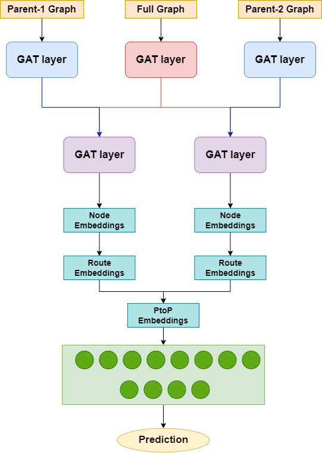
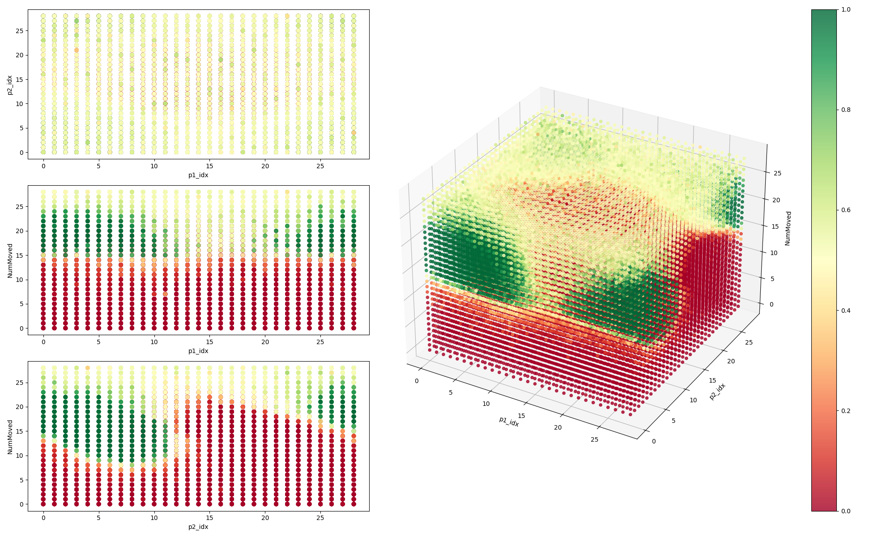
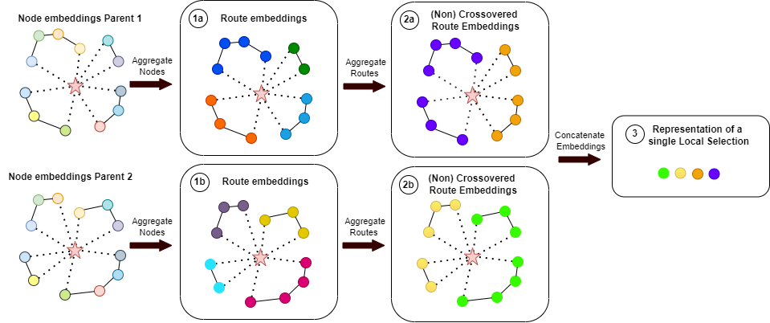

## Graph Neural Network for optimizing Hybrid Genetic Search

This repository contains the code of my thesis, which delved into optimizing the hybrid genetic search algorithm ([Vidal (2022)][1]). For this thesis, the [PyVRP][2] implementation of Hybrid Genetic Search was used.

> [!TIP]
> If you are new to vehicle routing or metaheuristics, the PyVRP library perfectly explains the basics on their website: [introduction to VRP][3] and [introduction to HGS][4].

## Table of Content

- [Summary of Research](#summary-of-research)

  - [The Proposed model](#the-proposed-model)
  - [The Node Embedding Transformations](#node-embedding-transformation)

- [Usage Instruction](#usage-instructions)
- [Code Documentation](#code-documentation)

## Summary of Research Method

### The Proposed model

Figure 1 illustrates the model proposed in this thesis. The architecture comprises three main elements: [the Graph Attention (GAT)](5) networks, the embedding transformations, and, finally, the fully-connected (FC) layers.

    
    
Figure 1: Diagram of proposed model

 
The input for the model consists of three different graphs: Parent-1 and Parent-2 which both represent a single solution to a VRP-problems, and the Full Graph which represent the whole VRP-problem graph(i.e. all edges and nodes of the problem).   
The output, shown in figure 2, is heatmap showing the likely best configuration of the Selective Route Exchange Crossover function given Parent-1 and Parent-2.

    
    
Figure 2: Diagram of proposed model

 

### Node Embedding Transformation

    
    
Figure 3: Diagram of Embedding Transformations: Each color represent a single h-dimensional embedding representing a node, route or a single local selection

## Usage Instructions

## Code Documentation

[1]: https://doi.org/10.1016/j.cor.2021.105643
[2]: https://github.com/PyVRP/PyVRP
[3]: https://pyvrp.org/setup/introduction_to_vrp.html
[4]: https://pyvrp.org/setup/introduction_to_hgs.html
[5]: https://arxiv.org/abs/1710.10903
